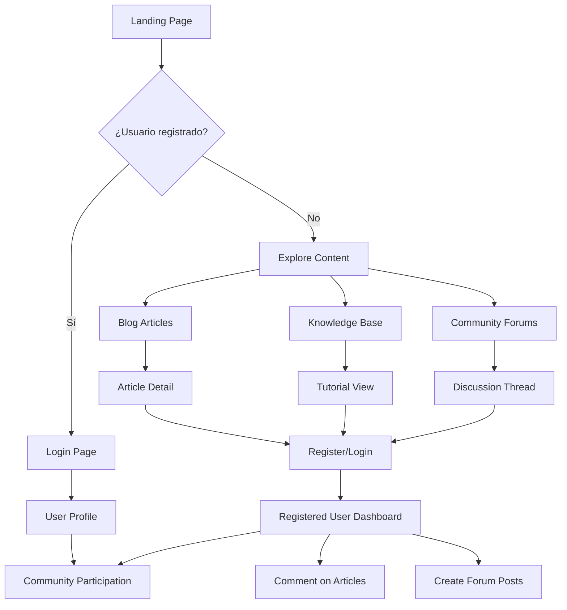

## 1. Product Overview

Creapolis Landing Page es un sitio web profesional que sirve como punto de entrada principal para el sistema de gestión de proyectos Creapolis. El objetivo es mostrar las capacidades de la aplicación, construir comunidad, proporcionar recursos educativos y convertir visitantes en usuarios registrados.

El producto resuelve la necesidad de tener una presencia web profesional que complemente la aplicación móvil Flutter existente, proporcionando contenido valioso sobre productividad, balance trabajo-vida y prevención del burnout, mientras captura leads y construye una comunidad sólida de usuarios.

## 2. Core Features

### 2.1 User Roles
| Role | Registration Method | Core Permissions |
|------|---------------------|------------------|
| Visitor | No registration required | Browse all public content, read articles, view landing page |
| Registered User | Email registration | Comment on articles, participate in community, access profile |
| Admin | Admin panel access | Create/edit/delete content, manage users, view analytics |

### 2.2 Feature Module

El sitio de aterrizaje de Creapolis consta de las siguientes páginas principales:

1. **Página Principal**: sección hero, características del producto, testimonios, llamadas a la acción.
2. **Sistema de Blog**: lista de artículos, detalles de artículos, categorías, búsqueda de contenido.
3. **Comunidad**: foros de discusión, perfiles de usuario, sistema de comentarios.
4. **Base de Conocimientos**: artículos tutoriales, FAQs, búsqueda inteligente de contenido.
5. **Soporte**: formulario de contacto, página de FAQs, sistema de tickets.
6. **Autenticación**: registro, login, recuperación de contraseña, perfil de usuario.

### 2.3 Page Details

| Page Name | Module Name | Feature description |
|-----------|-------------|---------------------|
| Home page | Hero section | Presenta Creapolis con diseño atractivo, incluye video demo y CTA principal para registro. |
| Home page | Features showcase | Muestra características principales con iconos, descripciones y animaciones al hacer scroll. |
| Home page | Testimonials | Carrusel de testimonios de usuarios con fotos, nombres y empresas. |
| Home page | CTA sections | Múltiples llamadas a la acción distribuidas estratégicamente en la página. |
| Blog | Article list | Muestra artículos con imagen destacada, título, extracto, autor, fecha y categorías. |
| Blog | Search and filter | Búsqueda por texto, filtrado por categoría y fecha, ordenamiento personalizable. |
| Blog | Pagination | Sistema de paginación responsivo para navegación entre artículos. |
| Blog | Categories | Sistema de categorías jerárquico para organización de contenido. |
| Blog Post | Article content | Visualización optimizada del contenido del artículo con formato Markdown/HTML. |
| Blog Post | Author info | Tarjeta del autor con foto, bio, enlaces sociales y otros artículos. |
| Blog Post | Comments system | Sistema de comentarios anidados con moderación y notificaciones. |
| Blog Post | Related articles | Sugerencias de artículos relacionados basadas en categorías y tags. |
| Community | User profiles | Perfiles públicos de usuarios con actividad reciente y estadísticas. |
| Community | Discussion forums | Foros organizados por temas con hilos de conversación. |
| Community | Activity feed | Feed de actividad reciente de la comunidad. |
| Knowledge Base | Article categories | Navegación por categorías de artículos tutoriales. |
| Knowledge Base | Search functionality | Búsqueda inteligente con autocompletado y sugerencias. |
| Knowledge Base | Tutorial viewer | Visualización paso a paso de tutoriales con imágenes y videos. |
| Support | Contact form | Formulario de contacto con validación y envío de email. |
| Support | FAQ section | Preguntas frecuentes organizadas por categorías con búsqueda. |
| Support | Ticket system | Sistema básico de tickets para seguimiento de soporte. |
| Auth | Registration | Formulario de registro con validación de email y contraseña segura. |
| Auth | Login | Login con email/contraseña y opción de "recordarme". |
| Auth | Password recovery | Sistema de recuperación de contraseña por email. |
| Auth | User profile | Panel de perfil con información personal y preferencias. |

## 3. Core Process

### Visitor Flow
1. Usuario llega a la página principal → Explora contenido → Lee artículos → Se registra para participar en comunidad
2. Usuario busca información → Encuentra artículo en blog o knowledge base → Consume contenido → Comparte o comenta

### Registered User Flow
1. Usuario registrado → Login → Accede a perfil → Participa en foros → Comenta artículos → Conecta con comunidad
2. Usuario con problema → Accede a soporte → Busca en FAQ → Envía formulario de contacto → Recibe ayuda

### Admin Flow
1. Admin → Login panel administración → Crea/edita contenido → Moderar comentarios → Analizar métricas → Gestionar usuarios

## 4. User Interface Design

### 4.1 Design Style
- **Colores primarios**: Azul profesional (#2563EB) con acento naranja (#F59E0B)
- **Colores secundarios**: Grises neutros (#6B7280, #9CA3AF) con fondo blanco
- **Estilo de botones**: Bordes redondeados con sombras sutiles, efectos hover suaves
- **Tipografía**: Inter para headers, system-ui para texto del cuerpo
- **Diseño de layout**: Enfoque en cards con espaciado generoso, navegación sticky header
- **Iconos**: Estilo outline consistente de Heroicons o Feather icons
- **Animaciones**: Transiciones suaves de 200-300ms, animaciones al hacer scroll

### 4.2 Page Design Overview

| Page Name | Module Name | UI Elements |
|-----------|-------------|-------------|
| Home page | Hero section | Imagen de fondo con overlay oscuro, título grande (48-64px), subtítulo (20-24px), botón CTA prominente, video demo opcional |
| Home page | Features | Grid responsivo de 3 columnas en desktop, cards con iconos grandes (48px), títulos (20-24px), descripciones concisas |
| Blog list | Article cards | Cards horizontales con imagen (16:9), título (24-32px), meta información en gris, extracto (14-16px), máximo 3 líneas |
| Blog post | Content area | Contenido centrado con máximo 800px, tipografía grande para lectura (18-20px), línea de 1.6, espaciado generoso |
| Community | Forum layout | Sidebar con categorías, área principal con lista de temas, información de última actividad, contadores de respuestas |

### 4.3 Responsiveness
- **Mobile-first approach**: Diseño optimizado para móviles con breakpoints en 640px, 768px, 1024px
- **Touch optimization**: Botones mínimo 44px, espaciado adecuado para dedos, swipe gestures en carruseles
- **Performance**: Imágenes optimizadas con lazy loading, código dividido por rutas, precarga de recursos críticos
- **SEO**: Meta tags dinámicos, structured data JSON-LD, sitemap XML generado automáticamente