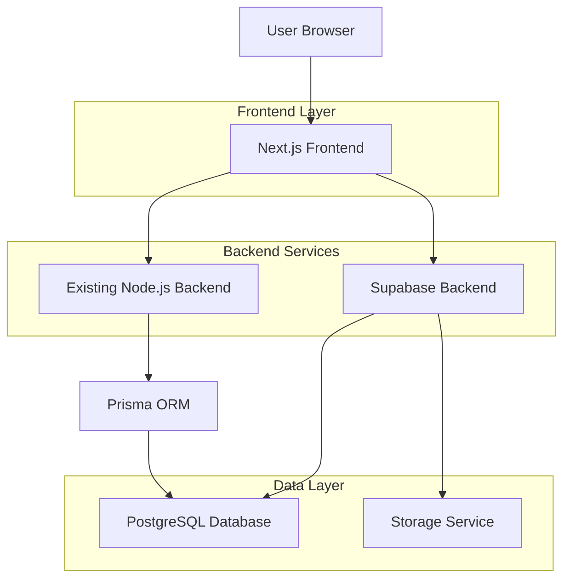
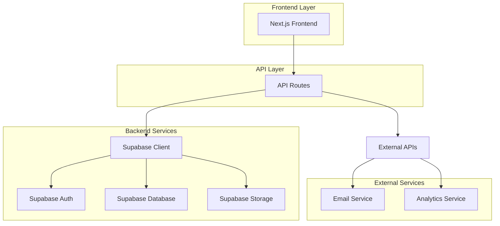
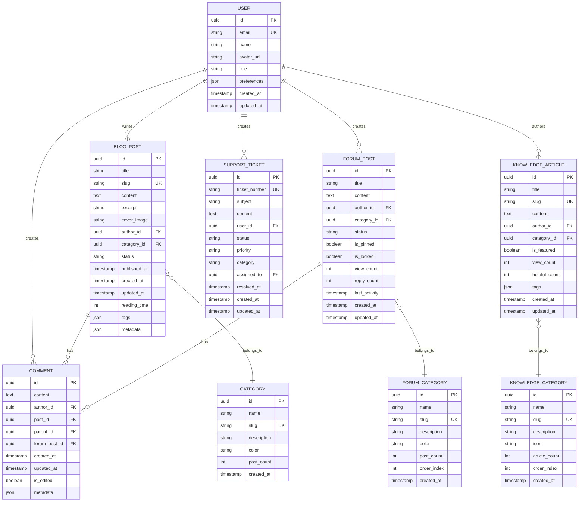

## 1. Architecture design



## 2. Technology Description

- **Frontend**: Next.js@14 + TypeScript + Tailwind CSS + Framer Motion
- **Backend**: Supabase (PostgreSQL, Auth, Storage, Real-time)
- **Integration**: Existing Node.js backend via REST API
- **Styling**: Tailwind CSS + Headless UI + Radix UI components
- **State Management**: Zustand + React Query (TanStack Query)
- **Content Management**: Markdown + MDX for blog posts
- **Search**: Supabase full-text search + Algolia (optional upgrade)
- **Analytics**: Plausible Analytics (privacy-focused)
- **Email**: Resend/SendGrid for transactional emails

## 3. Route definitions

| Route | Purpose |
|-------|---------|
| `/` | Landing page principal con hero section y características |
| `/blog` | Lista de artículos del blog con paginación y filtros |
| `/blog/[slug]` | Página individual de artículo del blog |
| `/blog/category/[slug]` | Artículos filtrados por categoría |
| `/knowledge-base` | Base de conocimientos con categorías y búsqueda |
| `/knowledge-base/[slug]` | Artículo individual de knowledge base |
| `/community` | Página principal de la comunidad |
| `/community/forum` | Foros de discusión por categorías |
| `/community/forum/[id]` | Hilo individual del foro |
| `/community/profile/[username]` | Perfil público de usuario |
| `/support` | Página de soporte con FAQs y contacto |
| `/support/contact` | Formulario de contacto |
| `/auth/login` | Página de inicio de sesión |
| `/auth/register` | Página de registro |
| `/auth/forgot-password` | Recuperación de contraseña |
| `/dashboard` | Panel de usuario registrado |
| `/admin` | Panel de administración de contenido |
| `/sitemap.xml` | Sitemap dinámico para SEO |
| `/robots.txt` | Configuración de robots |

## 4. API definitions

### 4.1 Blog API

**Obtener lista de artículos**
```
GET /api/blog/posts
```

Request:
| Param Name | Param Type | isRequired | Description |
|------------|-------------|-------------|-------------|
| page | number | false | Número de página (default: 1) |
| limit | number | false | Artículos por página (default: 10) |
| category | string | false | Filtrar por categoría |
| search | string | false | Búsqueda por título o contenido |
| sort | string | false | Ordenamiento (date, popularity, title) |

Response:
```json
{
  "posts": [
    {
      "id": "uuid",
      "title": "Cómo prevenir el burnout laboral",
      "slug": "como-prevenir-burnout-laboral",
      "excerpt": "Guía completa sobre prevención del burnout...",
      "coverImage": "https://...",
      "category": "productividad",
      "author": {
        "name": "María García",
        "avatar": "https://..."
      },
      "publishedAt": "2024-01-15T10:00:00Z",
      "readingTime": 8,
      "tags": ["burnout", "salud", "balance"]
    }
  ],
  "pagination": {
    "page": 1,
    "limit": 10,
    "total": 45,
    "totalPages": 5
  }
}
```

**Obtener artículo individual**
```
GET /api/blog/posts/[slug]
```

Response:
```json
{
  "post": {
    "id": "uuid",
    "title": "Cómo prevenir el burnout laboral",
    "slug": "como-prevenir-burnout-laboral",
    "content": "Contenido completo del artículo en markdown...",
    "coverImage": "https://...",
    "category": "productividad",
    "author": {
      "name": "María García",
      "bio": "Experta en bienestar laboral",
      "avatar": "https://...",
      "socialLinks": {...}
    },
    "publishedAt": "2024-01-15T10:00:00Z",
    "updatedAt": "2024-01-20T15:30:00Z",
    "readingTime": 8,
    "tags": ["burnout", "salud", "balance"],
    "relatedPosts": [...]
  }
}
```

### 4.2 Community API

**Crear comentario**
```
POST /api/community/comments
```

Request:
| Param Name | Param Type | isRequired | Description |
|------------|-------------|-------------|-------------|
| postId | string | true | ID del artículo |
| content | string | true | Contenido del comentario |
| parentId | string | false | ID del comentario padre (para respuestas) |

Response:
```json
{
  "comment": {
    "id": "uuid",
    "content": "Excelente artículo sobre burnout...",
    "author": {
      "name": "Juan Pérez",
      "avatar": "https://..."
    },
    "createdAt": "2024-01-25T14:30:00Z",
    "likes": 5,
    "replies": []
  }
}
```

### 4.3 Support API

**Enviar formulario de contacto**
```
POST /api/support/contact
```

Request:
| Param Name | Param Type | isRequired | Description |
|------------|-------------|-------------|-------------|
| name | string | true | Nombre del remitente |
| email | string | true | Email de contacto |
| subject | string | true | Asunto del mensaje |
| message | string | true | Contenido del mensaje |
| category | string | false | Categoría del soporte |

Response:
```json
{
  "success": true,
  "ticketId": "SUP-2024-001",
  "message": "Mensaje enviado correctamente"
}
```

## 5. Server architecture diagram



## 6. Data model

### 6.1 Data model definition



### 6.2 Data Definition Language

**Tabla de usuarios**
```sql
-- create table
CREATE TABLE users (
    id UUID PRIMARY KEY DEFAULT gen_random_uuid(),
    email VARCHAR(255) UNIQUE NOT NULL,
    name VARCHAR(100) NOT NULL,
    avatar_url TEXT,
    role VARCHAR(20) DEFAULT 'user' CHECK (role IN ('user', 'admin', 'moderator')),
    preferences JSONB DEFAULT '{}',
    created_at TIMESTAMP WITH TIME ZONE DEFAULT NOW(),
    updated_at TIMESTAMP WITH TIME ZONE DEFAULT NOW()
);

-- create index
CREATE INDEX idx_users_email ON users(email);
CREATE INDEX idx_users_role ON users(role);
CREATE INDEX idx_users_created_at ON users(created_at DESC);

-- RLS policies
ALTER TABLE users ENABLE ROW LEVEL SECURITY;
CREATE POLICY "Users can view all user profiles" ON users FOR SELECT USING (true);
CREATE POLICY "Users can update own profile" ON users FOR UPDATE USING (auth.uid() = id);
```

**Tabla de artículos del blog**
```sql
-- create table
CREATE TABLE blog_posts (
    id UUID PRIMARY KEY DEFAULT gen_random_uuid(),
    title VARCHAR(255) NOT NULL,
    slug VARCHAR(255) UNIQUE NOT NULL,
    content TEXT NOT NULL,
    excerpt VARCHAR(500),
    cover_image TEXT,
    author_id UUID NOT NULL REFERENCES users(id) ON DELETE CASCADE,
    category_id UUID REFERENCES categories(id) ON DELETE SET NULL,
    status VARCHAR(20) DEFAULT 'draft' CHECK (status IN ('draft', 'published', 'archived')),
    published_at TIMESTAMP WITH TIME ZONE,
    created_at TIMESTAMP WITH TIME ZONE DEFAULT NOW(),
    updated_at TIMESTAMP WITH TIME ZONE DEFAULT NOW(),
    reading_time INTEGER DEFAULT 5,
    tags JSONB DEFAULT '[]',
    metadata JSONB DEFAULT '{}'
);

-- create index
CREATE INDEX idx_blog_posts_slug ON blog_posts(slug);
CREATE INDEX idx_blog_posts_author ON blog_posts(author_id);
CREATE INDEX idx_blog_posts_category ON blog_posts(category_id);
CREATE INDEX idx_blog_posts_status ON blog_posts(status);
CREATE INDEX idx_blog_posts_published_at ON blog_posts(published_at DESC);
CREATE INDEX idx_blog_posts_search ON blog_posts USING gin(to_tsvector('spanish', title || ' ' || content));

-- RLS policies
ALTER TABLE blog_posts ENABLE ROW LEVEL SECURITY;
CREATE POLICY "Anyone can view published posts" ON blog_posts FOR SELECT USING (status = 'published');
CREATE POLICY "Admins can manage all posts" ON blog_posts FOR ALL USING (EXISTS (
  SELECT 1 FROM users WHERE id = auth.uid() AND role = 'admin'
));
```

**Tabla de categorías**
```sql
-- create table
CREATE TABLE categories (
    id UUID PRIMARY KEY DEFAULT gen_random_uuid(),
    name VARCHAR(100) NOT NULL,
    slug VARCHAR(100) UNIQUE NOT NULL,
    description TEXT,
    color VARCHAR(7) DEFAULT '#6B7280',
    post_count INTEGER DEFAULT 0,
    created_at TIMESTAMP WITH TIME ZONE DEFAULT NOW()
);

-- create index
CREATE INDEX idx_categories_slug ON categories(slug);
CREATE INDEX idx_categories_name ON categories(name);

-- Datos iniciales
INSERT INTO categories (name, slug, description, color) VALUES
('Productividad', 'productividad', 'Artículos sobre técnicas y herramientas de productividad', '#10B981'),
('Balance Trabajo-Vida', 'balance-trabajo-vida', 'Consejos para mantener un equilibrio saludable', '#F59E0B'),
('Prevención Burnout', 'prevencion-burnout', 'Guías para prevenir y manejar el burnout laboral', '#EF4444'),
('Gestión de Proyectos', 'gestion-proyectos', 'Mejores prácticas en gestión de proyectos', '#3B82F6'),
('Tecnología', 'tecnologia', 'Herramientas tecnológicas y tendencias', '#8B5CF6');
```

**Tabla de comentarios**
```sql
-- create table
CREATE TABLE comments (
    id UUID PRIMARY KEY DEFAULT gen_random_uuid(),
    content TEXT NOT NULL,
    author_id UUID NOT NULL REFERENCES users(id) ON DELETE CASCADE,
    post_id UUID REFERENCES blog_posts(id) ON DELETE CASCADE,
    parent_id UUID REFERENCES comments(id) ON DELETE CASCADE,
    forum_post_id UUID REFERENCES forum_posts(id) ON DELETE CASCADE,
    created_at TIMESTAMP WITH TIME ZONE DEFAULT NOW(),
    updated_at TIMESTAMP WITH TIME ZONE DEFAULT NOW(),
    is_edited BOOLEAN DEFAULT false,
    metadata JSONB DEFAULT '{}'
);

-- create index
CREATE INDEX idx_comments_author ON comments(author_id);
CREATE INDEX idx_comments_post ON comments(post_id);
CREATE INDEX idx_comments_parent ON comments(parent_id);
CREATE INDEX idx_comments_forum_post ON comments(forum_post_id);
CREATE INDEX idx_comments_created_at ON comments(created_at DESC);

-- RLS policies
ALTER TABLE comments ENABLE ROW LEVEL SECURITY;
CREATE POLICY "Anyone can view comments" ON comments FOR SELECT USING (true);
CREATE POLICY "Authenticated users can create comments" ON comments FOR INSERT USING (auth.role() = 'authenticated');
CREATE POLICY "Users can update own comments" ON comments FOR UPDATE USING (auth.uid() = author_id);
```

**Tabla de posts del foro**
```sql
-- create table
CREATE TABLE forum_posts (
    id UUID PRIMARY KEY DEFAULT gen_random_uuid(),
    title VARCHAR(255) NOT NULL,
    content TEXT NOT NULL,
    author_id UUID NOT NULL REFERENCES users(id) ON DELETE CASCADE,
    category_id UUID NOT NULL REFERENCES forum_categories(id) ON DELETE CASCADE,
    status VARCHAR(20) DEFAULT 'active' CHECK (status IN ('active', 'locked', 'archived')),
    is_pinned BOOLEAN DEFAULT false,
    is_locked BOOLEAN DEFAULT false,
    view_count INTEGER DEFAULT 0,
    reply_count INTEGER DEFAULT 0,
    last_activity TIMESTAMP WITH TIME ZONE DEFAULT NOW(),
    created_at TIMESTAMP WITH TIME ZONE DEFAULT NOW(),
    updated_at TIMESTAMP WITH TIME ZONE DEFAULT NOW()
);

-- create index
CREATE INDEX idx_forum_posts_author ON forum_posts(author_id);
CREATE INDEX idx_forum_posts_category ON forum_posts(category_id);
CREATE INDEX idx_forum_posts_status ON forum_posts(status);
CREATE INDEX idx_forum_posts_pinned ON forum_posts(is_pinned);
CREATE INDEX idx_forum_posts_last_activity ON forum_posts(last_activity DESC);

-- RLS policies
ALTER TABLE forum_posts ENABLE ROW LEVEL SECURITY;
CREATE POLICY "Anyone can view forum posts" ON forum_posts FOR SELECT USING (status = 'active');
CREATE POLICY "Authenticated users can create posts" ON forum_posts FOR INSERT USING (auth.role() = 'authenticated');
```