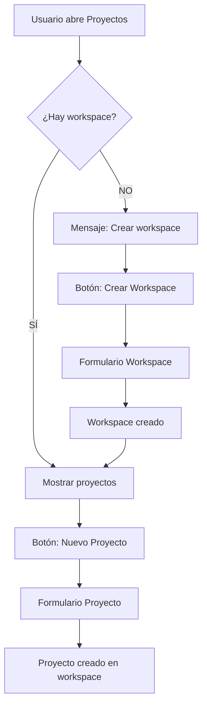

# 🔒 Mejora: Validación de Workspace para Creación de Proyectos

## 📋 Resumen

Se implementó un sistema de validación que **requiere que el usuario tenga un workspace activo antes de poder crear proyectos**. Esta mejora asegura la integridad de datos y mejora la experiencia del usuario al guiarlo correctamente en el flujo de trabajo.

---

## 🎯 Problema Identificado

**Situación anterior:**

- Los usuarios podían intentar crear proyectos sin tener un workspace activo
- La pantalla de proyectos permitía mostrar el formulario de creación incluso sin workspace
- No había mensajes claros sobre la necesidad de crear un workspace primero
- El botón flotante de "Nuevo Proyecto" estaba siempre habilitado

**Consecuencias:**

- Errores al intentar crear proyectos sin workspace
- Confusión del usuario sobre el orden correcto de acciones
- Mala experiencia de usuario

---

## ✅ Solución Implementada

### 1. **Validación en ProjectsListScreen**

#### FloatingActionButton Condicional

```dart
floatingActionButton: Consumer<WorkspaceContext>(
  builder: (context, workspaceContext, _) {
    final hasWorkspace = workspaceContext.hasActiveWorkspace;
    return FloatingActionButton.extended(
      onPressed: hasWorkspace
        ? () => _showCreateProjectSheet(context)
        : () => _showNoWorkspaceMessage(context),
      icon: const Icon(Icons.add),
      label: const Text('Nuevo Proyecto'),
    );
  },
),
```

**Comportamiento:**

- ✅ Si **hay workspace**: Abre el formulario de crear proyecto
- ❌ Si **NO hay workspace**: Muestra mensaje con acción para crear workspace

#### Mensaje de Alerta

```dart
void _showNoWorkspaceMessage(BuildContext context) {
  ScaffoldMessenger.of(context).showSnackBar(
    SnackBar(
      content: const Text(
        'Debes crear o seleccionar un workspace antes de crear proyectos',
      ),
      backgroundColor: Theme.of(context).colorScheme.error,
      action: SnackBarAction(
        label: 'Crear Workspace',
        textColor: Colors.white,
        onPressed: () => context.push('/workspaces/create'),
      ),
      duration: const Duration(seconds: 4),
    ),
  );
}
```

**Características:**

- 📱 SnackBar con mensaje claro
- 🔗 Acción directa para crear workspace
- ⏱️ Duración de 4 segundos para que el usuario pueda leer y actuar

---

### 2. **Estado Vacío Mejorado**

#### Diferenciación de Mensajes

```dart
Widget _buildEmptyState(BuildContext context) {
  final workspaceContext = context.watch<WorkspaceContext>();
  final hasWorkspace = workspaceContext.hasActiveWorkspace;

  return Center(
    child: Column(
      children: [
        Icon(
          hasWorkspace ? Icons.folder_open : Icons.workspaces_outlined,
          size: 80,
          color: colorScheme.onSurfaceVariant,
        ),
        Text(
          hasWorkspace ? 'No hay proyectos' : 'No hay workspace activo',
          style: theme.textTheme.titleLarge,
        ),
        Text(
          hasWorkspace
            ? 'Crea tu primer proyecto para comenzar'
            : 'Debes crear o seleccionar un workspace antes de crear proyectos',
          style: theme.textTheme.bodyMedium,
        ),
        FilledButton.icon(
          onPressed: hasWorkspace
            ? () => _showCreateProjectSheet(context)
            : () => context.push('/workspaces/create'),
          icon: Icon(hasWorkspace ? Icons.add : Icons.add_business),
          label: Text(hasWorkspace ? 'Crear Proyecto' : 'Crear Workspace'),
        ),
      ],
    ),
  );
}
```

**Estados:**

| Condición                         | Icono                 | Título                    | Botón             |
| --------------------------------- | --------------------- | ------------------------- | ----------------- |
| **Sin workspace**                 | `workspaces_outlined` | "No hay workspace activo" | "Crear Workspace" |
| **Con workspace (sin proyectos)** | `folder_open`         | "No hay proyectos"        | "Crear Proyecto"  |

---

### 3. **Validación en CreateProjectBottomSheet**

#### Validación Temprana

```dart
@override
void initState() {
  super.initState();

  // Validar que haya workspace activo
  WidgetsBinding.instance.addPostFrameCallback((_) {
    final workspaceContext = context.read<WorkspaceContext>();
    if (!workspaceContext.hasActiveWorkspace) {
      Navigator.of(context).pop();
      ScaffoldMessenger.of(context).showSnackBar(
        SnackBar(
          content: const Text(
            'Debes crear o seleccionar un workspace antes de crear proyectos',
          ),
          backgroundColor: Theme.of(context).colorScheme.error,
          duration: const Duration(seconds: 3),
        ),
      );
    }
  });

  // ... resto del init
}
```

**Flujo:**

1. 📝 El sheet se abre
2. ✅ **Validación inmediata** en `initState`
3. ❌ Si no hay workspace: **Cierra automáticamente** el sheet
4. 📢 Muestra mensaje de error
5. 🔒 Previene cualquier intento de crear proyecto sin workspace

#### Validación en Submit

```dart
void _handleSubmit() {
  if (_formKey.currentState?.saveAndValidate() ?? false) {
    // ... validaciones de formulario ...

    // Obtener workspace activo
    final workspaceContext = context.read<WorkspaceContext>();
    final activeWorkspace = workspaceContext.activeWorkspace;

    if (activeWorkspace == null) {
      ScaffoldMessenger.of(context).showSnackBar(
        const SnackBar(
          content: Text('No hay un workspace activo'),
          backgroundColor: Colors.red,
        ),
      );
      return; // ⛔ Bloquea el submit
    }

    // ✅ Crear proyecto con workspaceId
    context.read<ProjectBloc>().add(
      CreateProjectEvent(
        name: name,
        description: description,
        workspaceId: activeWorkspace.id, // 🔑 workspace requerido
        // ... otros campos
      ),
    );
  }
}
```

**Validaciones de seguridad:**

- ✅ Validación en `initState` (primera línea de defensa)
- ✅ Validación en `_handleSubmit` (segunda línea de defensa)
- ✅ El `workspaceId` es **requerido** en el evento

---

## 🎨 Experiencia de Usuario

### Flujo Correcto



### Escenarios

#### Escenario 1: Sin Workspace

```
1. Usuario entra a pantalla de Proyectos
2. Ve mensaje: "No hay workspace activo"
3. Ve botón: "Crear Workspace"
4. Hace clic en botón
5. Se redirige a formulario de workspace
```

#### Escenario 2: Con Workspace, Sin Proyectos

```
1. Usuario entra a pantalla de Proyectos
2. Ve mensaje: "No hay proyectos"
3. Ve botón: "Crear Proyecto"
4. Hace clic en botón
5. Se abre formulario de proyecto
6. El proyecto se crea en el workspace activo
```

#### Escenario 3: Intento de Crear Proyecto Sin Workspace

```
1. Usuario hace clic en botón flotante
2. Sistema detecta: sin workspace
3. Muestra SnackBar con mensaje de error
4. Ofrece acción: "Crear Workspace"
5. Usuario hace clic en acción
6. Se redirige a formulario de workspace
```

---

## 🔧 Archivos Modificados

### 1. `lib/presentation/screens/projects/projects_list_screen.dart`

**Cambios:**

- ✅ Agregado import de `provider`
- ✅ FloatingActionButton con validación de workspace
- ✅ Método `_showNoWorkspaceMessage()` con SnackBar
- ✅ Estado vacío diferenciado según workspace
- ✅ Uso de `Consumer<WorkspaceContext>` para reactividad

**Líneas afectadas:** ~40 líneas modificadas

### 2. `lib/presentation/widgets/project/create_project_bottom_sheet.dart`

**Cambios:**

- ✅ Validación en `initState` con cierre automático
- ✅ Validación adicional en `_handleSubmit`
- ✅ Mensaje de error si no hay workspace

**Líneas afectadas:** ~20 líneas modificadas

---

## 📊 Impacto

### Antes

- ❌ Errores al crear proyectos sin workspace
- ❌ Confusión en el flujo de trabajo
- ❌ Mala experiencia de usuario
- ❌ Posibles inconsistencias de datos

### Después

- ✅ **Imposible** crear proyectos sin workspace
- ✅ Flujo de trabajo claro y guiado
- ✅ Mensajes informativos y acciones directas
- ✅ Integridad de datos garantizada
- ✅ Experiencia de usuario mejorada

---

## 🧪 Testing

### Casos de Prueba

#### Test 1: Sin Workspace

```
DADO que el usuario no tiene workspace activo
CUANDO abre la pantalla de Proyectos
ENTONCES debe ver:
  - Icono de workspace
  - Mensaje "No hay workspace activo"
  - Botón "Crear Workspace"
Y NO debe poder crear proyectos
```

#### Test 2: FloatingActionButton Sin Workspace

```
DADO que el usuario no tiene workspace activo
CUANDO hace clic en el botón flotante "Nuevo Proyecto"
ENTONCES debe:
  - Mostrar SnackBar de error
  - Ofrecer acción "Crear Workspace"
  - NO abrir el formulario de proyecto
```

#### Test 3: Con Workspace

```
DADO que el usuario tiene workspace activo
CUANDO hace clic en el botón flotante "Nuevo Proyecto"
ENTONCES debe:
  - Abrir el formulario de proyecto
  - Permitir completar el formulario
  - Crear el proyecto en el workspace activo
```

#### Test 4: Validación en Sheet

```
DADO que el usuario no tiene workspace activo
CUANDO de alguna manera abre el CreateProjectBottomSheet
ENTONCES el sheet debe:
  - Cerrarse automáticamente
  - Mostrar mensaje de error
  - Prevenir la creación del proyecto
```

---

## 📝 Notas Técnicas

### WorkspaceContext

```dart
// Propiedades utilizadas
bool get hasActiveWorkspace => _activeWorkspace != null;
Workspace? get activeWorkspace => _activeWorkspace;
```

### Navegación

```dart
// Ruta para crear workspace
context.push('/workspaces/create');
```

### Estado Reactivo

- Se utiliza `Consumer<WorkspaceContext>` para reactividad
- Se utiliza `context.watch<WorkspaceContext>()` en builders
- Se utiliza `context.read<WorkspaceContext>()` para operaciones puntuales

---

## 🚀 Siguientes Pasos

### Posibles Mejoras Futuras

1. **Selector de Workspace en Formulario**

   - Permitir seleccionar workspace diferente al activo al crear proyecto
   - Mostrar lista de workspaces disponibles

2. **Indicador Visual de Workspace**

   - Mostrar chip con nombre del workspace activo en AppBar
   - Badge indicando número de workspaces disponibles

3. **Tour Guiado**

   - Tutorial interactivo para nuevos usuarios
   - Explicar flujo: Workspace → Proyecto → Tarea

4. **Validaciones Adicionales**
   - Permisos de usuario (guest no puede crear)
   - Límite de proyectos por workspace
   - Validación de nombre duplicado

---

## ✅ Checklist de Implementación

- [x] Validación en FloatingActionButton
- [x] Mensaje de error con acción
- [x] Estado vacío diferenciado
- [x] Validación en CreateProjectBottomSheet (initState)
- [x] Validación en submit del formulario
- [x] Import de provider agregado
- [x] Testing de compilación (flutter analyze: 0 issues)
- [x] Documentación completada

---

## 🎉 Resultado

**La aplicación ahora garantiza que:**

1. ✅ No se pueden crear proyectos sin workspace
2. ✅ El usuario recibe mensajes claros y accionables
3. ✅ El flujo de trabajo es intuitivo y guiado
4. ✅ La integridad de datos está asegurada
5. ✅ La experiencia de usuario es consistente y profesional

**Análisis de código:** ✅ **0 issues found**
